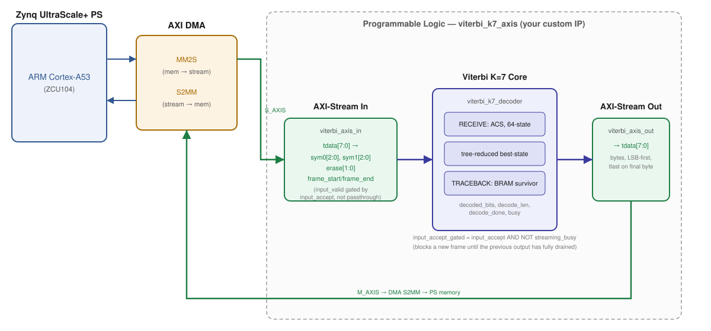
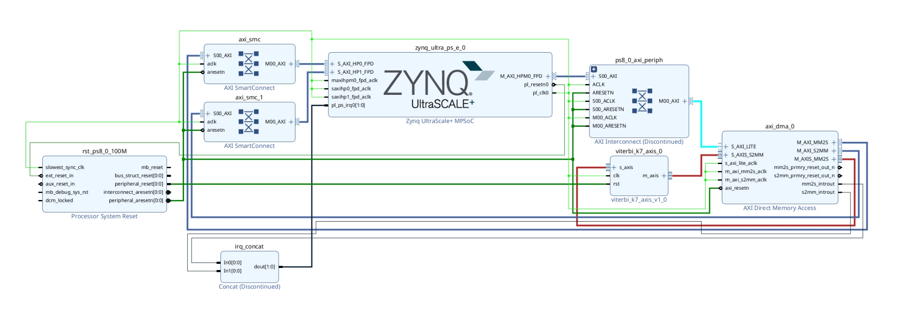
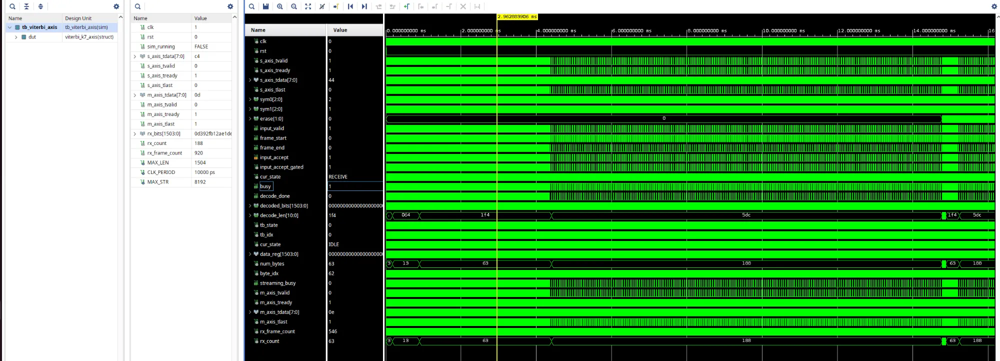
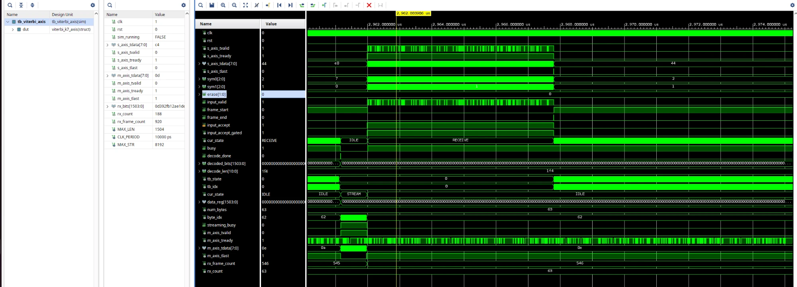
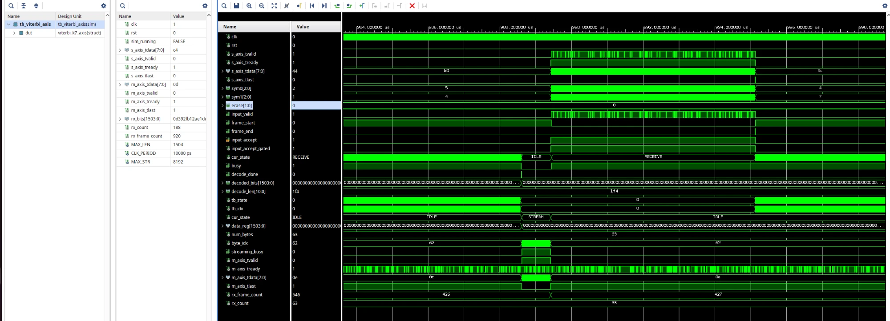
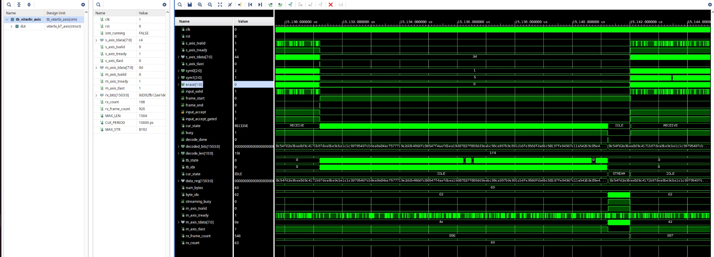

# Viterbi K=7 Soft-Decision Decoder for openwifi

A clean-room VHDL Viterbi decoder (constraint length K=7, rate 1/2, IEEE 802.11
generator polynomials), packaged as a real AXI4-Stream IP and integrated with
an AXI DMA on a Zynq UltraScale+ (ZCU104), built as a drop-in replacement
target for openwifi's decode path. No HLS, no vendor IP, hand-written and
hand-verified RTL.

## Architecture

Three blocks wrapped as one IP (`viterbi_k7_axis`):

- **`viterbi_axis_in`** unpacks each incoming AXI4-Stream byte into `sym0`/`sym1`
  (3-bit soft confidence per coded bit) and `erase` (per-bit erasure flags for
  punctured codes), and tracks frame boundaries from `tlast`.
- **`viterbi_k7_decoder`** is the actual decoder: a 64-state Add-Compare-Select
  trellis with a tree-reduced (not linear-scan) best-state search, a
  BRAM-backed survivor memory, and a two-phase traceback.
- **`viterbi_axis_out`** serializes the decoded bits back out as bytes with
  `tlast` on the final one, and reports `streaming_busy` so the wrapper can
  hold off a new frame until the previous output has fully drained.

The whole thing talks to the PS only through a standard AXI DMA (MM2S in,
S2MM out), so it carries zero raw top-level data pins, that matters, see
"What this is not" below.

## Real, measured results

- **Verification**: a Python golden reference model (validated against a
  published K=3 textbook example before scaling to K=7) generates every test
  vector. 1000/1000 hard-decision cases pass, then 920/920 soft-decision +
  erasure cases pass bit-for-bit against the same golden model, 80 of those
  920 specifically constructed so erasure changes the correct answer, not
  just exercises the port.
- **Soft-decision gain measured, not assumed**: a real BPSK+AWGN channel
  simulation ([`measure_soft_gain.py`](measure_soft_gain.py)) shows
  soft-decision decoding needs roughly 1.7 to 2 dB less Eb/N0 than
  hard-decision for the same frame error rate.
- **Real synthesis and timing closure** on an actual ZCU104 part
  (`xczu7ev-ffvc1156-2-e`), full system including the AXI DMA and PS:
  10,230 LUTs (4.44% of the device), **WNS +0.090 ns**, TNS 0.000, 0 failing
  endpoints out of 25,475. All constraints met.

*PS + AXI SmartConnects + AXI DMA + `viterbi_k7_axis_0`, as implemented.*

*AXI-Stream in/out, the adapter-to-core symbol signals, and both internal
state machines, from a live run of the full 920-case regression.*

*A single frame's handshake zoomed in: `sym0`/`sym1`/`erase` arriving while
`input_valid` pulses, the core's `cur_state` moving IDLE &#8594; RECEIVE, and the
output adapter's own `cur_state` moving IDLE &#8594; STREAM &#8594; IDLE as it drains.*

*The same handshake shape recurring at frame 426/427, roughly 1000 frames
later in the run, not a one-off.*

*`decoded_bits`/`decode_len` on `decode_done`, cross-checked: `decode_len =
0x1f4` (500) and `num_bytes = 63 = ceil(500/8)` agree.*

## Real defects found and fixed

This is the part most write-ups leave out. In the order they were actually
hit:

1. **Golden model bit-ordering bug**: an initial single hand-check of the
   shift-register direction gave false confidence; the real bug was only
   found by an exhaustive 8-combination automated search against the full
   trellis.
2. **Reset polarity**: Vivado's clock/reset automation wired the decoder's
   active-high `rst` to an active-low `peripheral_aresetn` net. Caught by
   explicit Tcl verification of the actual driving pin, not assumed correct.
3. **`decode_len` port width**: VHDL `integer` ports are not properly sized
   by Vivado's IP-XACT packager (packaged as 32 bits regardless of real
   range), causing a real synthesis port-width mismatch. Fixed by switching
   to a fixed-width `std_logic_vector`.
4. **Catastrophic timing failure (-27.9 ns)**: the 1504x64-bit survivor
   memory wasn't inferring as block RAM, because traceback read and used it
   in the same cycle. Fixed with a two-phase fetch/use split.
5. **Second timing failure (-20.2 ns)**: the 64-way best-state search was a
   linear scan, 111 logic levels deep. Fixed with a balanced 6-level tree
   reduction.
6. **1521 I/O ports**: an earlier, raw-port version of the design could not
   be placed on real silicon at all. Fixed architecturally with the
   AXI4-Stream + DMA wrapper above.
7. **Orphaned SmartConnect**: wiring both DMA masters to the same AXI HP port
   via two separate automation calls silently created a second, disconnected
   SmartConnect. Fixed by using two distinct HP ports.

Every one of these was caught by reading real tool output (synthesis logs,
timing reports, an exhaustive search) rather than assumed fixed, and three of
them survived an initial wrong first guess before the real root cause was
found.

## What this is not

Being specific about the gap is part of the point:

- No side-by-side resource or timing comparison against Xilinx's own
  `viterbi_v7_0` LogiCORE exists, it isn't licensed in this environment. The
  interface (`sym0`/`sym1`/`erase`) matches it and openofdm's production RTL
  by design, so the comparison is at least well-posed, but it hasn't been run.
- The erasure mechanism is generic and verified, but no specific 802.11
  puncture pattern (rate 2/3, 3/4) is wired up yet.

## On-hardware status: programmed and running, readout blocked by a confirmed tooling limitation

The bitstream has been generated and programmed onto a real ZCU104 over JTAG
(`xczu7_0`), confirmed by a post-configuration hardware readback, not just a
successful command. A bare-metal AXI DMA test application
([`main.c`](vivado_proj/firmware/main.c)) was written, built with the
real Vitis 2025.2 unified toolchain, and launched on the APU over JTAG: the
FSBL runs natively to bring up PS/DDR, then the test application downloads
and starts cleanly, with no error from the download or run commands
themselves.

What is not yet confirmed is the PASS/FAIL result of that run, and the
reason is now pinned down precisely rather than just worked around. Three
independent ways to read the result back each hit a real failure (UART
capture across all three USB-UART channels, halting the core over JTAG to
read DDR, and reading DDR through the debug port without touching the
core), and a careful process of elimination, including two full physical
power cycles to separate stale debug-session state from the real cause,
ruled out every plausible explanation on this project's side: wrong UART
port or baud (checked against AMD's own ZCU104 user guide and this design's
generated `psu_init.c` and found correct), PS-PL isolation or fabric reset
not released (the verified fix was applied; no change), and an ARM
exception-level mismatch between FSBL and the application (disproved with
a direct register dump: the core is at EL3 both times).

The decisive test: AMD's own unmodified `hello_world` template app, built
for this same platform and run through the identical FSBL-then-application
JTAG sequence, fails in exactly the same way: no UART output, and the core
cannot be halted afterward. Since that is AMD's reference code, not this
project's, this confirms the limitation is in the JTAG debug *flow* itself
(chaining a standalone application after FSBL via `rst`/`dow`/`con` in
xsct, which its own banner already flags as deprecated), not in this
design, this firmware, or anything specific to this project.

So the decoder's physical validity on silicon is confirmed (synthesis,
timing closure, and a clean configuration readback), the test application
is confirmed to build and launch, and the blocker on seeing its result is
now a specifically identified tool/flow limitation rather than an open
question, documented in full (including every ruled-out hypothesis) for
anyone hitting the same wall. It is not a defect in the RTL itself, which
already passed 1920/1920 simulated cases bit-for-bit. The next real step is
either the newer Vitis Python debug API in place of deprecated xsct, or a
proper `BOOT.BIN` boot from SD/QSPI so FSBL hands off to the application
natively, with no debugger-injected reset in between.

## Why this matters

The Viterbi algorithm itself is not novel, it's close to 60 years old, and
Xilinx has shipped a production decoder core for two decades. Claiming
otherwise would be the first thing a real RTL engineer would call out, so
that's not the claim here.

What this repo actually demonstrates is the full pipeline that an RTL audit
or custom-IP engagement sells: a golden reference model, exhaustive
automated verification, real synthesis and timing closure on real silicon,
and, unusually, an unfiltered log of every real defect hit along the way
instead of a curated success story. The interface and polynomials match real
production RTL on purpose, so none of the numbers above require taking
anyone's word for it.

## Repo layout

| Path | What it is |
|---|---|
| [`golden_reference.py`](golden_reference.py) | Python golden model (hard + soft decision), self-checks against a published example |
| [`gen_stimulus.py`](gen_stimulus.py) / [`gen_stimulus_soft.py`](gen_stimulus_soft.py) | Test vector generators (1000 hard-decision cases; 920 soft-decision + erasure cases) |
| [`measure_soft_gain.py`](measure_soft_gain.py) | Independent BPSK+AWGN measurement of soft-decision coding gain |
| [`vhdl/viterbi_k7_decoder.vhd`](vhdl/viterbi_k7_decoder.vhd) | The decoder core |
| [`vhdl/viterbi_k7_pkg.vhd`](vhdl/viterbi_k7_pkg.vhd) | Trellis table and branch-metric functions |
| [`vhdl/viterbi_axis_in.vhd`](vhdl/viterbi_axis_in.vhd) / [`viterbi_axis_out.vhd`](vhdl/viterbi_axis_out.vhd) | AXI4-Stream adapters |
| [`vhdl/viterbi_k7_axis.vhd`](vhdl/viterbi_k7_axis.vhd) | Top-level IP wrapper |
| [`vhdl/tb_viterbi_axis.vhd`](vhdl/tb_viterbi_axis.vhd) | AXI-Stream testbench with randomized stalls on both sides |
| [`vivado_proj/07_block_design_axis.tcl`](vivado_proj/07_block_design_axis.tcl) | Block design: PS + AXI DMA + custom IP |
| [`vivado_proj/09_impl_axis.tcl`](vivado_proj/09_impl_axis.tcl) / [`10_impl_axis_retry.tcl`](vivado_proj/10_impl_axis_retry.tcl) | Synthesis/implementation, including the retry that closed the final timing gap |
| [`vivado_proj/13_write_bitstream.tcl`](vivado_proj/13_write_bitstream.tcl) / [`14_check_hw.tcl`](vivado_proj/14_check_hw.tcl) / [`15_program_board.tcl`](vivado_proj/15_program_board.tcl) | Bitstream generation, live hardware connectivity check, and JTAG programming |
| [`vivado_proj/16_export_xsa.tcl`](vivado_proj/16_export_xsa.tcl) / [`create_platform.py`](vivado_proj/create_platform.py) / [`build_app.py`](vivado_proj/build_app.py) | Hardware platform export and the Vitis unified Python API scripts that build the firmware platform and application |
| [`vivado_proj/firmware/main.c`](vivado_proj/firmware/main.c) | Bare-metal AXI DMA test application (built and launched on hardware; see "On-hardware status" above) |
| [`vivado_proj/18_jtag_run_via_fsbl.tcl`](vivado_proj/18_jtag_run_via_fsbl.tcl) | JTAG bring-up: FSBL runs natively for PS/DDR init, then downloads and starts the test application |
| [`vivado_proj/25_full_diagnostic.tcl`](vivado_proj/25_full_diagnostic.tcl) | The decisive diagnostic: PS-PL release, FSBL, a full register/exception-level dump, then AMD's own `hello_world` template through the same chain, isolating the JTAG halt/UART failure to the debug flow itself |
| [`vivado_proj/create_hello_app.py`](vivado_proj/create_hello_app.py) / [`build_hello_app.py`](vivado_proj/build_hello_app.py) | Builds AMD's unmodified `hello_world` template on this platform, used as the control test above |

## Status

Simulation, synthesis, and timing closure complete and passing. The
bitstream is generated and programmed onto real hardware with a verified
readback, and the bare-metal test application builds and launches cleanly
over JTAG. The on-hardware data-path result itself is not yet confirmed; see
"On-hardware status" above for exactly what was tried and what remains.
